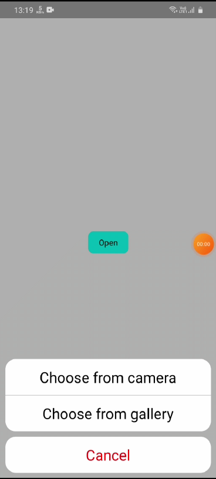

# react-native-action-sheet-modal

Highly customizable Action sheet modal for react native.

<p align="center">
    
</p>

## Setup

This library is available on npm, install it with: `npm i react-native-action-sheet-modal`.

## Usage

1.  Import Actionsheet from react-native-action-sheet-modal:

```javascript
import Actionsheet from 'react-native-action-sheet-modal';
```

2.  Create a modal and nest its content inside of it:

```javascript
function OptionsWindow() {
  return (
    <ActionSheet options={list} isVisible={visible} onClose={()=>onClose()} onChange={onChange}/>
  )
}
```

## A complete example

```javascript
/**
 * Sample React Native App
 * https://github.com/facebook/react-native
 *
 * @format
 * @flow strict-local
 */

import React, { useState } from 'react';
import {
  StyleSheet,
  View,
  Text,
  TouchableOpacity,
} from 'react-native';

import ActionSheet from 'react-native-action-sheet-modal'

const App = () => {
  const [visible, setVisible] = useState(false)
  const [result, setResult] = useState('')
  const list = [{ name: "Choose from camera", value: 'Choose from camera', extraData:{type:"video"} }, { name: "Choose from gallery", value: 'Choose from gallery', extraData:{type:"video"} }]

  function onChange(value, extraData) {
    setResult(value)
    onClose()
  }

  function onClose(){
    setVisible(false)
  }

  function modalShow(){
    console.log('modalShow')
  }

  return (
    <>
      <ActionSheet 
        options={list} 
        isVisible={visible} 
        onClose={()=>onClose()} 
        onChange={onChange}
        hideCancel={false}
        cancelText='close'
        cancelTextStyle={{fontSize:15}}
        cancelContainerStyle={{backgroundColor:'white'}}
        optionsTextStyle={{fontSize:15}}
        optionsContainerStyle={{backgroundColor:'white'}}
        modalProps={{animationInTiming:500, onModalShow:()=>modalShow()}}
      />
      <View style={styles.container}>
        <TouchableOpacity 
        onPress={()=>setVisible(true)}
        style={styles.button}><Text>Open</Text></TouchableOpacity>
        <Text>{result}</Text>
      </View>
    </>
  );
};


const styles = StyleSheet.create({
  container: { flex: 1, justifyContent: 'center', alignItems: 'center' },
  button:{ paddingHorizontal: 20, marginVertical:20, paddingVertical: 10, backgroundColor: "cyan", borderRadius: 10, },
});

export default App;

```

## Props

| Name | Type | Required |Description  | Default |
|--|--|--|--|--|
| isVisible | boolean | Yes | boolean value(true/false) to open/close the action sheet. | false |
| onClose | function | Yes | function to call while clicking cancel button and the backdrop area | () => {} |
| options | array | Yes | list of options to display | [] |
| onChange | function | Yes | function to call while choosing an option | () => {} |
| hideCancel | boolean | No | to hide the bottom cancel button | false |
| cancelText | string | No | text to be display on the cancel button | "Cancel" |
| cancelTextStyle | object | No | to update the style of the cancel button text | |
| cancelContainerStyle | object | No | to update the style of the cancel button container | |
| optionsTextStyle | object | No | to update the text style of the options | |
| optionsContainerStyle | object | No | to update the options container style | |
| modalProps | object | No | It accepts all the props of the react-native-modal package. For all props, Kindly refer the react-native-modal package. | |

Pull requests, feedbacks and suggestions are welcome!